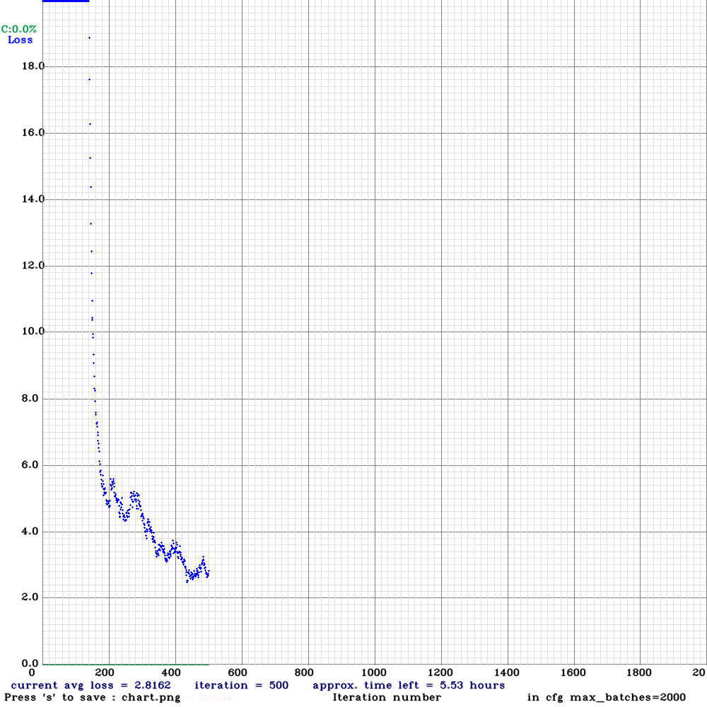
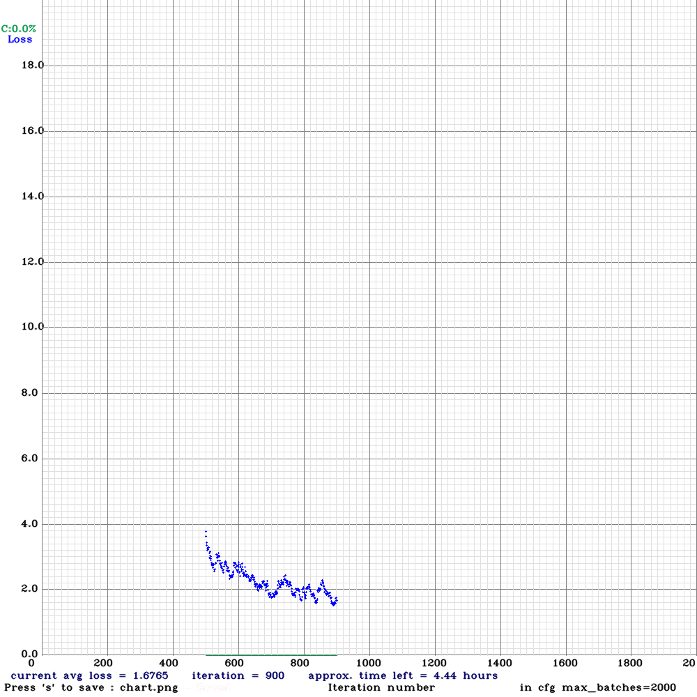
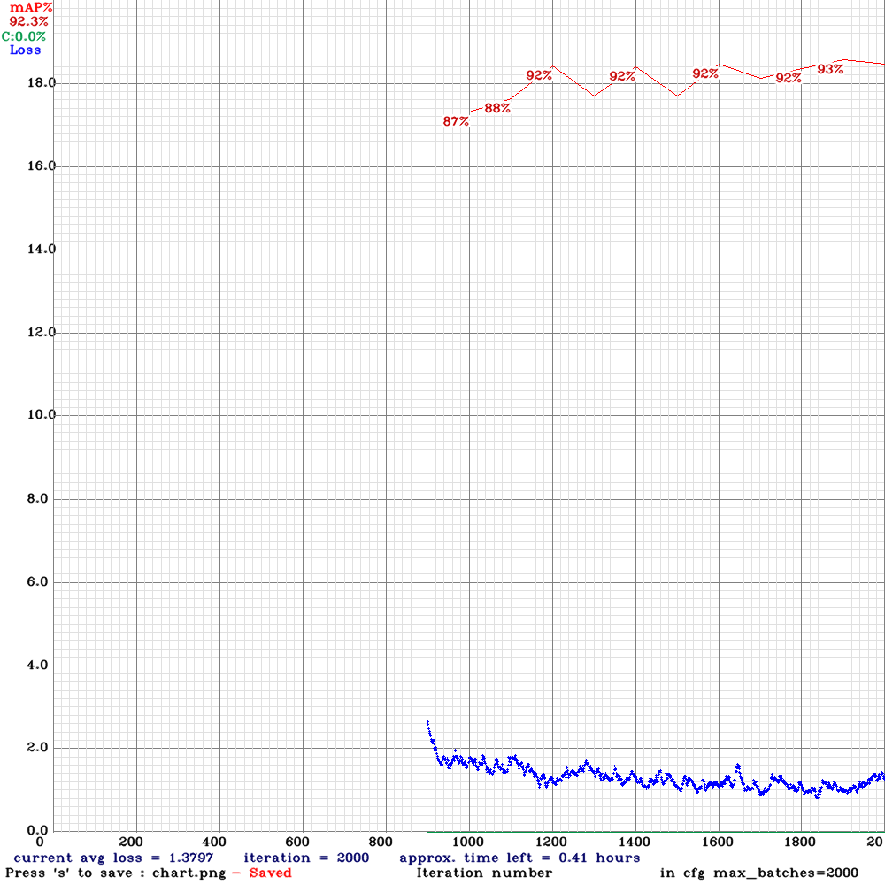

# Ship Detection in Aerial Images using YOLOv4

## Project Overview
This project is a highlight of my undergraduate experience, focusing on **Object Detection in Aerial Images using Deep Learning**. I developed a ship detection system leveraging the **YOLOv4 algorithm**, achieving an impressive **96% accuracy**. Inspired by **ISRO’s satellite data analysis**, the project demonstrates advanced techniques in computer vision and deep learning, with results published in the **2023 11th International Conference on Emerging Trends in Engineering & Technology**.

The system is capable of identifying ships in **aerial images, videos, and real-time streams** with high precision, showcasing the strengths of YOLOv4 for real-world applications.

---

## Challenges in Neural Network Development
Developing a ship detection system for aerial imagery presents unique challenges. Here are some key obstacles and how they were addressed:

1. **Class Imbalance**:
   - **Challenge**: Sparse presence of ships in large aerial images leads to class imbalance, with overwhelming background data.
   - **Solution**: Techniques like **focal loss**, **oversampling ship patches**, and data augmentation were employed to balance the dataset.

2. **Scale Variance and Small Objects**:
   - **Challenge**: Ships vary significantly in size, making smaller ships harder to detect.
   - **Solution**: YOLOv4’s **multi-scale prediction** and splitting high-resolution images into smaller patches improved sensitivity to size variations.

3. **Noise and Distortions**:
   - **Challenge**: Aerial imagery contains noise from atmospheric conditions and sensor limitations.
   - **Solution**: Applied **Gaussian blur** for noise reduction and augmented the data with synthetic noise to enhance robustness.

4. **Environmental and Lighting Variability**:
   - **Challenge**: Variations in weather, time of day, and location affect ship appearance.
   - **Solution**: Trained on a diverse dataset with augmentations like brightness and contrast adjustments.

---

## Why YOLOv4?
During the exploration phase, various models and data preprocessing techniques were considered, including **data augmentation with GANs**, **noise reduction (Gaussian blur)**, **normalization**, and **contrast enhancement**. However, YOLOv4 proved to be a comprehensive solution due to its advanced features:

### Key Techniques of YOLOv4:
1. **CSPDarknet53**: Backbone for robust feature extraction.
2. **Spatial Pyramid Pooling (SPP)**: Extracts multi-scale features without losing spatial resolution.
3. **Batch Normalization**: Stabilizes training and improves convergence.
4. **Mosaic Augmentation**: Enriches the dataset with diverse contexts and scales.

### Advanced Features:
- **Bag of Freebies**:
  - Improves accuracy, reduces overfitting, and ensures noise robustness with training-time techniques like data augmentation and regularization without impacting inference speed.
- **Bag of Specials**:
  - Enhances scale variance handling, localization precision, and feature extraction with advanced architectural enhancements, boosting model performance.

---

## Results
By leveraging the above features, the YOLOv4-based ship detection system achieved:
- **96% accuracy** in detecting ships in aerial imagery.
- High performance in diverse scenarios, including noisy, low-resolution, and high-variation environments.

This project underscores YOLOv4’s effectiveness in real-world applications, particularly in challenging environments like aerial and satellite imagery analysis.

## Training Graphs

#### Video Demonstration:
<video width="600" controls>
  <source src="Output\output.mp4" type="video/mp4">
  Your browser does not support the video tag.
</video>

---

## Citation
This work was published in the **2023 11th International Conference on Emerging Trends in Engineering & Technology**. Please cite accordingly if you use or refer to this project.

---

## Contact
For any inquiries or collaborations, feel free to reach out!

---

**Note**: Always remember to install the required dependencies and follow the instructions in the repository to reproduce the results.